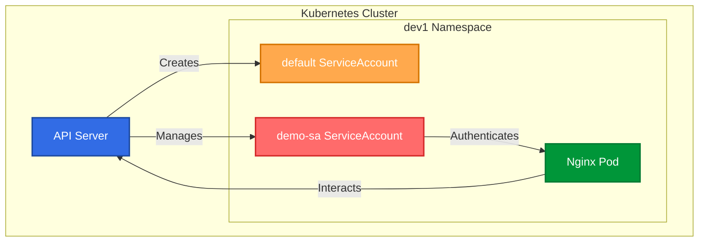

# 🚀 Kubernetes Pod Service Account Management

[](https://github.com/TheToriqul/k8s-pod-service-account)


## 📋 Project Overview

This project demonstrates advanced Kubernetes identity management through practical implementation of Service Accounts in pod deployments. It showcases the creation and configuration of custom service accounts, namespace management, and secure pod deployment practices in Kubernetes environments.

## 🎯 Key Objectives

- Implement secure pod deployment using custom service accounts in Kubernetes
- Master namespace isolation and multi-environment management
- Demonstrate advanced pod configuration and service account assignment
- Practice real-world Kubernetes security best practices
- Gain hands-on experience with kubectl command-line operations

## 🏗️ Project Architecture
This architecture represents a **Kubernetes Cluster** with an **API Server** managing resources within a `dev1` namespace. It includes two **ServiceAccounts** (`default` and `demo-sa`), where `demo-sa` authenticates an **Nginx Pod**. The **API Server** interacts with the pod, ensuring secure communication and resource management within the cluster.



## 💻 Technical Stack

- **Container Runtime**: Docker
- **Orchestration**: Kubernetes
- **Web Server**: Nginx
- **Operating System**: Ubuntu 20.04
- **Development Tools**: VS Code, kubectl

## 🚀 Getting Started

<details>
<summary>🐳 Prerequisites</summary>

- Kubernetes cluster (v1.20+)
- kubectl CLI tool
- Basic understanding of Kubernetes concepts
- Docker installed (optional for local development)

</details>

<details>
<summary>⚙️ Installation</summary>

1. Clone the repository:
   ```bash
   git clone https://github.com/TheToriqul/k8s-pod-service-account.git
   ```
2. Navigate to the project directory:
   ```bash
   cd k8s-pod-service-account
   ```
3. Verify kubectl configuration:
   ```bash
   kubectl cluster-info
   ```

</details>

<details>
<summary>🎮 Usage</summary>

1. Create the required namespace:
   ```bash
   kubectl create ns dev1
   ```
2. Deploy the service account:
   ```bash
   kubectl create serviceaccount demo-sa -n dev1
   ```
3. Deploy the pod with custom service account:
   ```bash
   kubectl run demo --image=nginx -n dev1 --overrides='{"spec": {"serviceAccountName": "demo-sa"}}' --dry-run=client -o json | kubectl apply -f -
   ```

For detailed commands and explanations, refer to the [reference-commands.md](reference-commands.md) file.

</details>

## 💡 Key Learnings

### Technical Mastery:

1. Advanced Kubernetes RBAC implementation
2. Service Account management and configuration
3. Namespace isolation strategies
4. Pod security and identity management
5. kubectl command-line mastery

### Professional Development:

1. Infrastructure security best practices
2. Kubernetes resource organization
3. Documentation and technical writing
4. System architecture design
5. DevOps workflow optimization

## 🔄 Future Enhancements

<details>
<summary>View Planned Improvements</summary>

1. Implement role-based access control (RBAC) policies
2. Add monitoring and logging capabilities
3. Create Helm charts for deployment
4. Implement pod security policies
5. Add automated testing workflows
6. Integrate with CI/CD pipelines

</details>

## 🙌 Contribution

Contributions are welcome! Feel free to [open an issue](https://github.com/TheToriqul/k8s-pod-service-account/issues) or submit a [pull request](https://github.com/TheToriqul/k8s-pod-service-account/pulls) to suggest improvements or add features.

## 📧 Connect with Me

- 📧 Email: toriqul.int@gmail.com
- 🌐 LinkedIn: [@TheToriqul](https://www.linkedin.com/in/thetoriqul/)
- 🐙 GitHub: [@TheToriqul](https://github.com/TheToriqul)
- 🌍 Portfolio: [TheToriqul.com](https://thetoriqul.com)

Let's connect and discuss Kubernetes, cloud-native technologies, and beyond!

## 👏 Acknowledgments

- Poridhi for providing comprehensive learning resources and inspiration
- The Kubernetes community for excellent documentation
- Fellow developers who provided valuable feedback

---

Thank you for exploring this project! I hope you find it useful for understanding Kubernetes service accounts and pod management. Happy containerizing! 🚀